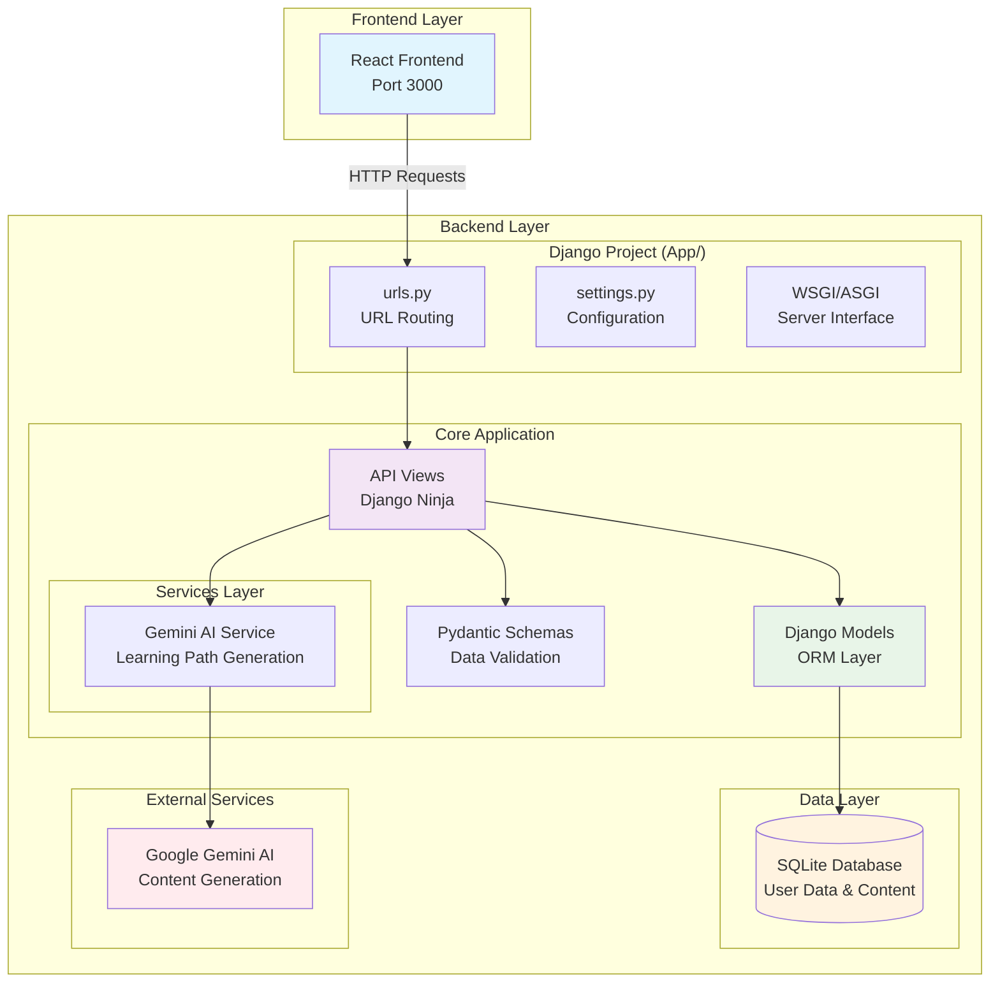
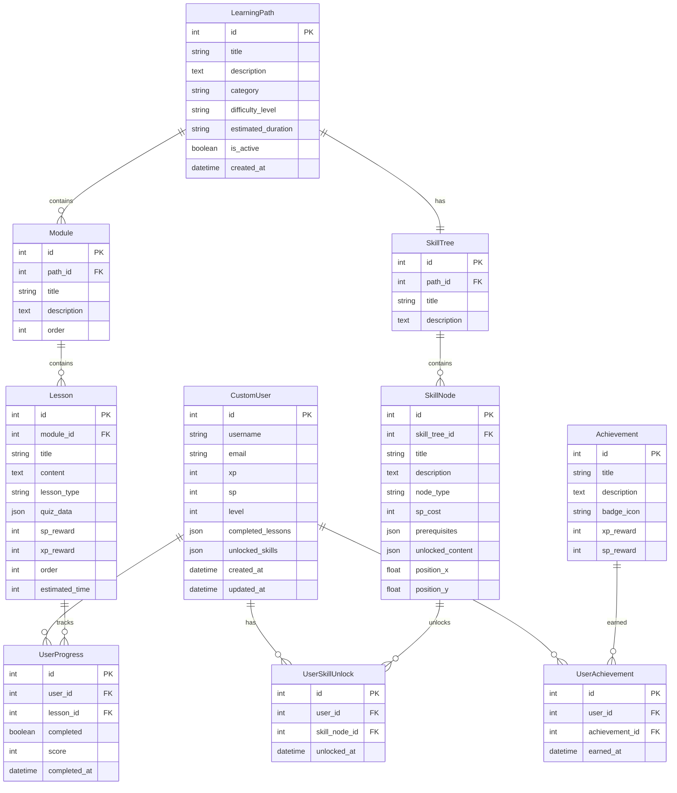
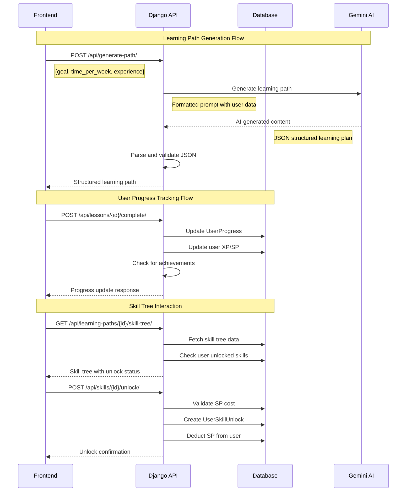

# 🎓 Gamified Learning Platform - Backend
> A Django-based REST API backend for a gamified learning platform with AI-powered personalized learning paths, comprehensive progress tracking, and skill tree progression system.

## ✨ Features

- 🤖 **AI-Powered Learning Paths** - Generate personalized learning content using Google Gemini AI
- 🎮 **Gamification System** - XP, skill points, levels, achievements, and skill trees
- 📊 **Progress Tracking** - Comprehensive lesson completion and performance analytics
- 🔐 **User Management** - Custom user model with gamification features
- 🌐 **Modern API** - RESTful API built with Django Ninja and Pydantic schemas
- 📱 **CORS Enabled** - Ready for frontend integration

## 🛠️ Technology Stack

| Component | Technology | Version |
|-----------|------------|---------|
| **Framework** | Django | 5.1.3 |
| **API Framework** | Django Ninja | 1.3.0 |
| **Database** | SQLite | (Development) |
| **AI Integration** | Google Generative AI | 0.8.3 |
| **CORS Support** | django-cors-headers | 4.3.1 |
| **Environment** | python-dotenv | 1.0.1 |
| **PostgreSQL** | psycopg2-binary | 2.9.9 |
| **Image Processing** | Pillow | 10.4.0 |

## 📁 Project Structure

```
Backend/
└── App/                       # 🏠 Main Django Application
    ├── .env                   # 🔐 Environment variables
    ├── db.sqlite3            # 💾 SQLite database
    ├── manage.py             # ⚙️ Django management script
    ├── requirements.txt      # 📦 Python dependencies
    ├── test_api.py          # 🧪 API tests
    ├── test_gemini.py       # 🤖 Gemini AI tests
    ├── list_models.py       # 📋 Model listing utility
    │
    ├── App/                  # 🎯 Django Project Configuration
    │   ├── __init__.py
    │   ├── settings.py       # ⚙️ Django configuration
    │   ├── urls.py          # 🛣️ URL routing
    │   ├── wsgi.py          # 🌐 WSGI configuration
    │   └── asgi.py          # ⚡ ASGI configuration
    │
    └── Core/                 # 💎 Main Application Logic
        ├── __init__.py
        ├── admin.py         # 👨‍💼 Django admin configuration
        ├── apps.py          # 📱 App configuration
        ├── models.py        # 🗃️ Database models
        ├── views.py         # 👀 Traditional Django views
        ├── tests.py         # 🧪 Unit tests
        │
        ├── api/             # 🚀 API Layer
        │   ├── views.py     # 🎯 API endpoints
        │   ├── schemas.py   # 📋 Pydantic schemas
        │   └── services/    # 🔧 Business logic services
        │       └── gemini.py # 🤖 Gemini AI integration
        │
        └── migrations/      # 📊 Database migrations
            ├── __init__.py
            └── 0001_initial.py
```

## 🏗️ System Architecture



## 🗄️ Database Schema



## 🚀 API Endpoints

### 🔧 Core Endpoints

| Method | Endpoint | Description | Response Schema |
|--------|----------|-------------|-----------------|
| `GET` | `/api/health/` | 💚 Health check | `{"status": "ok", "message": "..."}` |
| `POST` | `/api/generate-path/` | 🤖 Generate AI learning path | `LearningPathOutput` |
| `GET` | `/api/user/me/` | 👤 Get current user | `UserSchema` |
| `PATCH` | `/api/user/me/` | ✏️ Update user | `UserSchema` |

### 📚 Learning Management

| Method | Endpoint | Description | Response Schema |
|--------|----------|-------------|-----------------|
| `GET` | `/api/learning-paths/` | 📋 List all learning paths | `List[LearningPathSchema]` |
| `GET` | `/api/learning-paths/{id}/` | 📖 Get specific learning path | `LearningPathSchema` |
| `POST` | `/api/lessons/{id}/complete/` | ✅ Complete a lesson | Success message |
| `GET` | `/api/user/progress/` | 📊 Get user progress | Progress data |

### 🎮 Gamification

| Method | Endpoint | Description | Response Schema |
|--------|----------|-------------|-----------------|
| `POST` | `/api/skills/{id}/unlock/` | 🔓 Unlock skill node | Success message |
| `GET` | `/api/learning-paths/{id}/skill-tree/` | 🌳 Get skill tree | `SkillTreeSchema` |

## 🔄 Data Flow



## 🎯 Core Features

### 🎮 Gamification System
- 🏆 **Experience Points (XP)** - Earned through lesson completion
- ⭐ **Skill Points (SP)** - Currency for unlocking skill tree nodes
- 📈 **Leveling System** - Automatic level calculation based on XP
- 🏅 **Achievement System** - Badges and rewards for milestones
- 🌳 **Skill Trees** - Visual progression paths with prerequisites

### 🤖 AI-Powered Learning Paths
- 🧠 **Gemini Integration** - Generates personalized learning content
- 🎯 **Adaptive Content** - Based on user goals, time, and experience
- 📋 **Structured Output** - JSON-formatted learning phases
- 🛡️ **Fallback System** - Graceful degradation if AI service fails

### 📊 Progress Tracking
- ✅ **Lesson Completion** - Track individual lesson progress
- 📝 **Quiz Scoring** - Store quiz results and performance
- 🔥 **Streak Tracking** - Monitor learning consistency
- 📈 **Progress Analytics** - Comprehensive progress metrics

### 🏗️ Modular Architecture
- 🎯 **Separation of Concerns** - Clear API, service, and data layers
- ⚡ **Django Ninja** - Modern API framework with automatic documentation
- 🔒 **Pydantic Schemas** - Type-safe data validation
- 🔧 **Service Layer** - Business logic abstraction

## 🔐 Security & Best Practices

### ✅ Current Implementation
- 🌐 **CORS Configuration** - Restricted to localhost:3000 for development
- 🔑 **Environment Variables** - API keys stored in .env file
- 🛡️ **Django Security** - Built-in CSRF and security middleware

### 🚀 Production Recommendations
- 🔐 **Authentication** - Implement JWT or session-based auth
- 👥 **Authorization** - Role-based access control
- 🔒 **HTTPS** - SSL/TLS encryption for all endpoints
- ⏱️ **Rate Limiting** - API request throttling
- 🧹 **Input Validation** - Enhanced data sanitization
- 🗄️ **Database Security** - PostgreSQL with proper permissions

## ⚡ Performance & Optimization

### 📊 Current State
- 💾 **SQLite** - Suitable for development and small-scale deployment
- 🔄 **Synchronous Processing** - Standard Django request handling
- 🧠 **In-Memory Caching** - None implemented

### 🚀 Optimization Opportunities
- 🐘 **Database** - Migrate to PostgreSQL for production
- ⚡ **Caching** - Implement Redis for session and query caching
- 🔄 **Async Processing** - Use Celery for background tasks
- 🌐 **CDN** - Static file delivery optimization
- 📈 **Database Indexing** - Optimize query performance

## 🧪 Testing Strategy

### ✅ Current Tests
- 🔗 **`test_api.py`** - API endpoint testing
- 🤖 **`test_gemini.py`** - AI service integration testing

### 📋 Recommended Test Coverage
- 🧪 **Unit Tests** - Model methods and business logic
- 🔗 **Integration Tests** - API endpoint functionality
- 🔧 **Service Tests** - External API integration
- ⚡ **Performance Tests** - Load and stress testing
- 🔐 **Security Tests** - Vulnerability assessment


## 🚀 Quick Start

### Prerequisites
- Python 3.8+
- pip or pipenv

### Installation

```bash
# Clone the repository
git clone <repository-url>
cd Backend/App

# Install dependencies
pip install -r requirements.txt

# Set up environment variables
cp .env.example .env
# Add your GEMINI_API_KEY to .env

# Run migrations
python manage.py migrate

# Start development server
python manage.py runserver
```

### API Documentation
Once running, visit `http://localhost:8000/api/docs` for interactive API documentation.

## 🤝 Contributing

1. Fork the repository
2. Create a feature branch (`git checkout -b feature/amazing-feature`)
3. Commit your changes (`git commit -m 'Add amazing feature'`)
4. Push to the branch (`git push origin feature/amazing-feature`)
5. Open a Pull Request

## 📄 License

This project is licensed under the MIT License - see the [LICENSE](LICENSE) file for details.

## 🙏 Acknowledgments

- [Django](https://djangoproject.com/) - The web framework for perfectionists with deadlines
- [Django Ninja](https://django-ninja.rest-framework.com/) - Fast Django REST framework
- [Google Gemini AI](https://ai.google.dev/) - AI-powered content generation
- [Mermaid](https://mermaid-js.github.io/) - Diagram and flowchart generation

---

## 📊 Project Stats


---

**Built with ❤️ for the developer community**
